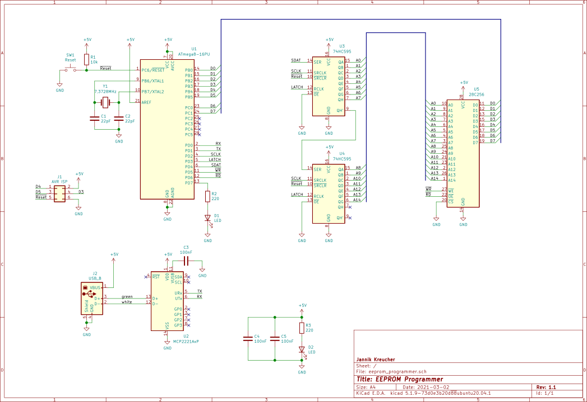
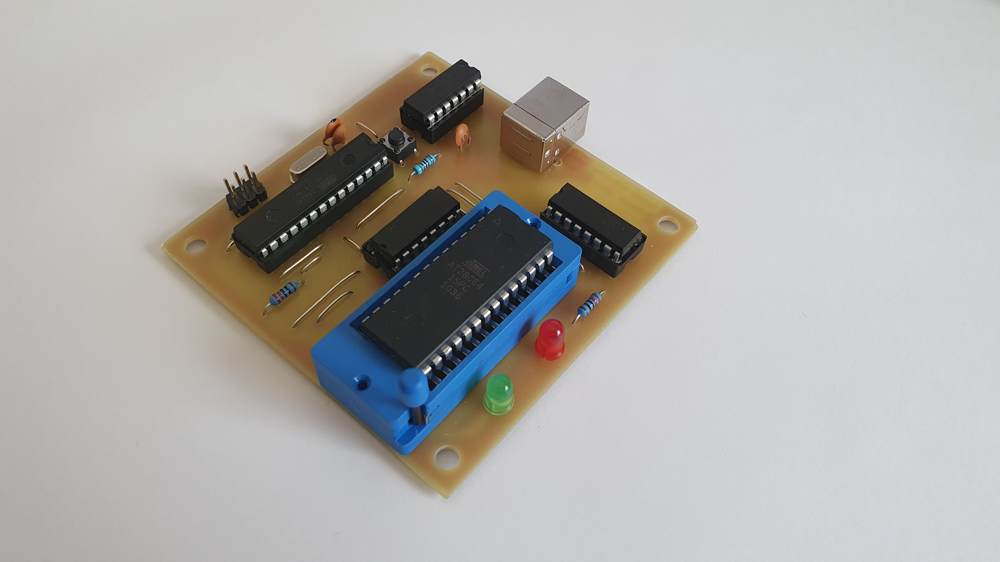
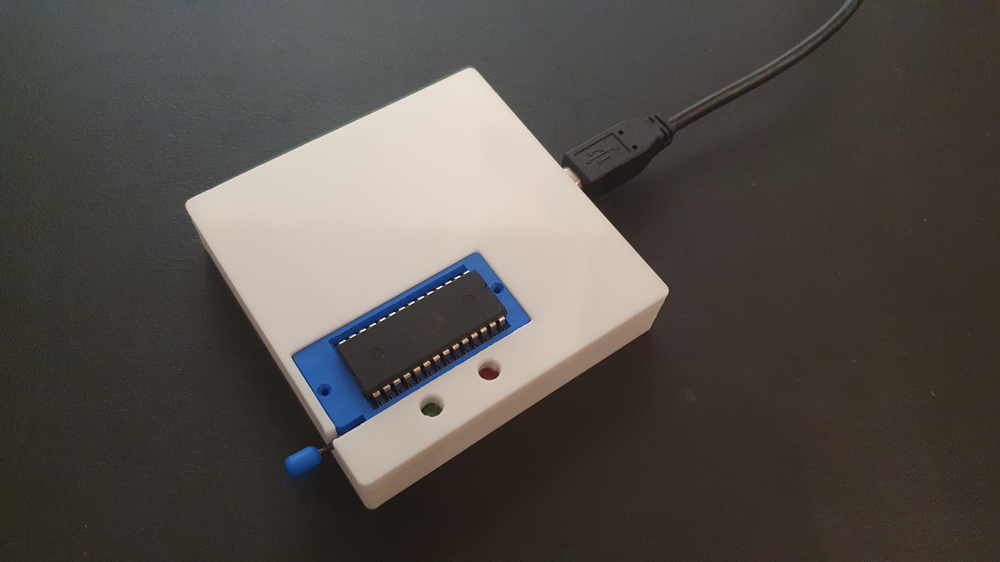

# Simple EEPROM Programmer

Copyright 2021 Jannik Kreucher


## Table of Contents
 - [Project](#project)
 - [Dependencies](#dependencies)
 - [Make](#make)
 - [Flash EEPROM](#flash-eeprom)
 - [Schematic](#schematic)
   - [Processor](#micro-processor)
   - [Shift Registers](#shift-registers)
   - [EEPROM](#eeprom)
 - [PCB](#pcb)
 - [Enclosure](#enclosure)
 - [License](#license)


## Project

I created this programmer for my personal Z80 project. Since commerical programmers are fairly expensive I created my own simple programmer. It is nothing fancy and just supports a single family of [EEPROMs](https://en.wikipedia.org/wiki/EEPROM). It does not have support for a higher programming voltage and is limited for +5V EEPROMs.

This simple programmer supports following EEPROMs:
 - [28c64 (8k)](http://ww1.microchip.com/downloads/en/devicedoc/doc0001h.pdf)
 - [28c256 (32k)](http://ww1.microchip.com/downloads/en/DeviceDoc/doc0006.pdf)


## Dependencies

To compile the code you need to have following tools installed:
 - avr-gcc (with avr-libs)
 - avrdude
 - uisp

The programmer flash tool uses [Python3](https://www.python.org/) and [pySerial](https://pyserial.readthedocs.io/en/latest/pyserial.html):
 - python3
 - python3-serial

The Makefile contains a command to install everything needed:
```
cd code
sudo make tools
```


## Make

First compile the ATmega code. Execute following in the project root folder:
```
cd code
make
```

Now flash the compiled code to the programmer. *Connect the ISP-Programmer* and execute:
```
make fuses
make upload
```
I am using a USBasp Programmer. **Note: Notch on ISP-Programmer must be facing the ATmega8 chip (U1) while flashing firmware.**


## Flash EEPROM

**Note: Firmware needs to be flashed beforehand !**

To flash your binary file to the EEPROM inserted type:
```
cd code
chmod +x eeprom.py
./eeprom.py -e -o -p /dev/ttyACM0 -b 115200 -w <binaryfile.bin>
```

For more information:
```
./eeprom.py -h
```


## Schematic



### Micro Processor
The micro processor used in this project is the popular [ATmega8 (U1)](https://ww1.microchip.com/downloads/en/DeviceDoc/Atmel-2486-8-bit-AVR-microcontroller-ATmega8_L_datasheet.pdf), a cheaper version of the ATmega328 used in the [Arduino Uno](https://store.arduino.cc/arduino-uno-rev3). It handles everything: the serial communication, address bus and the data bus. U2 (MCP2221) handles the USB to UART conversion so no external ftdi cable is needed. The supply voltage is conveniantly given by the USB port also. Because data bus of the EEPROM is bidirectional it is directly connected to the processor. It needs to handle setting the bus as input or output. See [`code/eeprom.c`](code/eeprom.c) for everything I/O related. The UART is handled in [`/code/uart.c`](code/uart.c). And the communication protocol is defined in [`/code/parser.c`](code/parser.c) and in [`/code/main.c`](code/main.c).

### Shift Registers
The shift registers (U3, U4) are utilized to expand the IO of the processor. Just 3 bits are needed to set the address bus to the target address. Since the address bus is only one way no data needs to be read from the address bus thus making shift registers the obvious choice for this situation. See [`/code/eeprom.c: addrbus_set()`](code/eeprom.c) for how the data is latched.

### EEPROM

The EEPROM uses a parallel interface for communication. The address bus (A0-A14) is a parallel input which sets the memory location to read or write. The control lines ~WE and ~OE (active low) tell the EEPROM to read or write from/to the memory. The data is read from or sent out the parallel data bus (D0-D7) depending on the state of the control lines. Some EEPROMs have Write-Protect enabled. A algorithm (see datasheet) is implemented to deactivate write protection. See [`/code/eeprom.c: eeprom_disable_protect()`](code/eeprom.c) for how this works.


## PCB

Note: The pcb is designed so that the top layer represents jumpers. The vias are large enough to stick a wire through.

For the schematic and pcb layout I used [KiCad](https://kicad.org/), a very awsome open source EDA.

The clearances and spaces are designed for diy home etching. Nothing really fancy.




## Enclosure

The very simple, easy and fast to print enclosure consists of two parts which sandwhich the pcb. Needed are just *4x M3,5x12mm* wood screws to assemble the enclosure.




## License

[MIT](LICENSE) Jannik Kreucher
